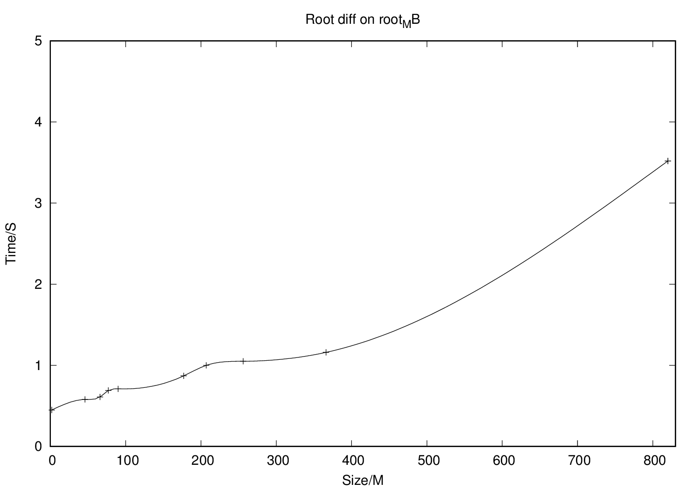

##ROOT DIFF

### Introduction

This program can be used to compare two root files. Root file is used for storing serialized root 
object, which used by [ROOT Data Analysis Framework](https://root.cern.ch/).

There are two available mode for comparing

1. **CC** - COMPRESSED COMPARE, which compare the compressed object buffer.
2. **UC** - UNCOMPRESSED COMPARE, which uncompress the object buffer and compare. 
 
And there are three levels of agreement  

1. **LOGIC** - compare the hierarchical structure of two root files.
2. **STRICT** - root files should be logic equivalence and objects from 
two root files should be equal to each other on byte level.
3. **EXACT** - root files should be strictly equivalence and objects from 
two root files should have same timestamp.

### Installation

1. Software requirements

    - ROOT 6.02 or above version
    - g++ 4.6.7 or above version   

2. How to Install

    - Install on `earth.crc.nd.edu`
        If you have access to `earth.crc.nd.edu`
        Before building please remove the gcc module and load the 
        root, python/2.7.8 module by typing following commands:
        
        ```sh
        module rm gcc
        module load root python/2.7.8
        ```
        
        Then you can build the program by typing
   
        ```sh  
        make
        ```
        After build, `root_diff` in `bin/` can be used to compare the 
        two root files, more details can be found through `bin/root_diff -h`
         
    - Using docker image
        If you have docker daemon running on your machine, a docker image
        is avaliable in `docker/` directory. You can build the image by
        typing

        ```sh
        docker build -t <image_name:tag> .
        ```     
        Then you can launch docker container with an interactive bash shell 
        by typing 

        ```sh
        docker run -it <image_name:tag> 
        ```

### Usage 

Following are examples of using `root_diff`, `*.root` files used in 
examples can be found in `sample_root_files` folder.

1. Two root files are exactlly equal to each other 

    ```sh
    bin/root_diff -m CC -l r1_r1.log sample_root_files/r1.root sample_root_files/r1.root
    ```
    
    The expected output will be:
        
        -----------------------------------------------------------
        file 1: sample_root_files/r1.root
        file 2: sample_root_files/r1.root
        The comparison mode is: COMPRESS COMPARE
        file 1 is EQUAL to file 2.
        The agreement level is EXACT
        Details can be found in r1_r1.log
        -----------------------------------------------------------

2. Two root files are stricly equal to each other
   
    ```sh 
    bin/root_diff -m UC -l fx1_fx2.log sample_root_files/fx1.root sample_root_files/fx2.root
    ```
    The expected output will be:
       
        -----------------------------------------------------------
        file 1: sample_root_files/fx1.root
        file 2: sample_root_files/fx2.root
        The comparison mode is: COMPRESS COMPARE
        file 1 is EQUAL to file 2.
        The agreement level is STRICT
        Details can be found in fx1_fx2.log
        -----------------------------------------------------------
                         
3. Two root files are logically equal to each other

    ```sh
    bin/root_diff -m CC -l r1_r2.log sample_root_files/r1.root sample_root_files/r2.root
    ```

    The expected output will be:

        -----------------------------------------------------------
        file 1: sample_root_files/r1.root
        file 2: sample_root_files/r2.root
        The comparison mode is: COMPRESS COMPARE
        file 1 is EQUAL to file 2.
        The agreement level is LOGICAL
        Details can be found in r1_r2.log
        -----------------------------------------------------------

### Benchmark

We benchmark the performace of the `root_diff` on different scales of root files. Followings
are benchmark results. 

1. Running `root_diff` on GB level files, there is an outlier `/hadoop/store/user/awoodard/minus/BEAN_53xOn53x_V04_skims/WWJetsTo2L2Nu_TuneZ2star_8TeV-madgraph-tauola_Summer12_DR53X-PU_S10_START53_V7A-v1_skimDilep_BEAN_53xOn53x_V04_CV02/d821efbc3befd142036a29052ef27c00/output_3_1_azi.root`
    

2. Running `root_diff` on MB level files 
    

### TODO

1. Outlier is caused by memory limit or file structure

2. Have 10 files can fit in the memory and 10 files can not fit in the memeory

3. Make y axis MB/s (throughput)

4. Have bar chart for root files with different level of complexity

5. count the number of comparisons

6. statics about the comparisons of different tobject
