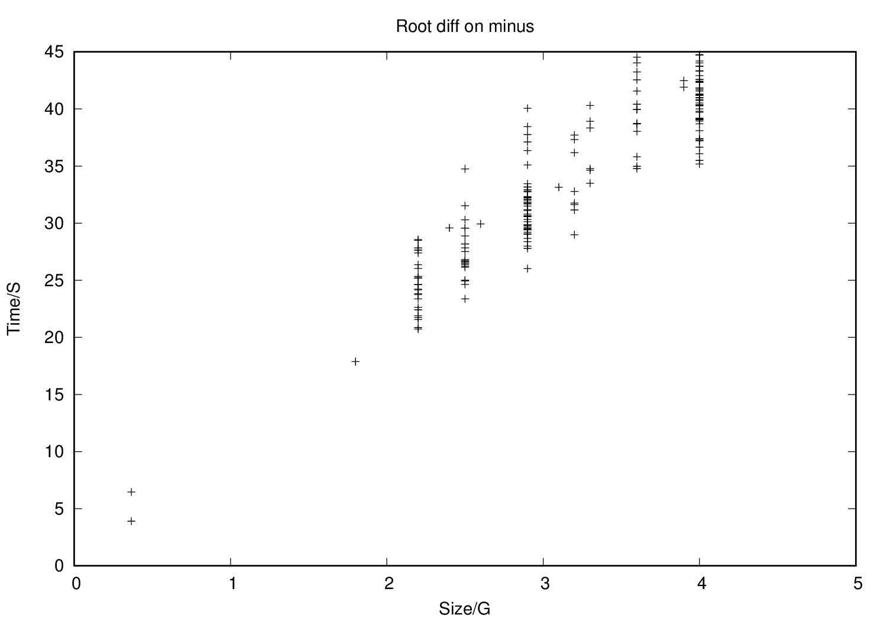

##ROOT DIFF

### Introduction

This program can be used to compare two root files.

There are three available mode for comparing

1. **CC** - COMPRESSED COMPARE, which compare the compressed object buffer.
2. **UC** - UNCOMPRESSED COMPARE, which uncompress the object buffer and compare. 
 
And there are three levels of agreement  

1. **LOGIC** - compare the hierarchical structure of two root files.
2. **STRICT** - root files should be logic equivalence and objects from 
two root files should be equal to each other on byte level.
3. **EXACT** - root files should be strictly equivalence and objects from 
two root files should have same timestamp.

This program can only be built on crc.nd.edu.
Before building please remove the gcc module and load the 
root, python/2.7.8 module by typing following commands:

        module rm gcc
        module load root python/2.7.8

Then you can build the program by executing

        make

After build, `root_cmp` in bin/ can be used to compare the 
two root files, more details can be found through `bin/root_cmp -h`

Following are examples of using `root_cmp`, `*.root` files used in 
examples can be found in `sample_root_files` folder.

1. Two root files are exactlly equal to each other 

        bin/root_cmp -m CC -l r1_r1.log -f sample_root_files/r1.root,sample_root_files/r1.root
    
    The expected output will be:
        
        -----------------------------------------------------------
        file 1: sample_root_files/r1.root
        file 2: sample_root_files/r1.root
        The comparison mode is: COMPRESS COMPARE
        file 1 is EQUAL to file 2.
        The agreement level is EXACT
        Details can be found in r1_r1.log
        -----------------------------------------------------------

2. Two root files are stricly equal to each other

        bin/root_cmp -m UC -l fx1_fx2.log -f sample_root_files/fx1.root,sample_root_files/fx2.root

    The expected output will be:
       
        -----------------------------------------------------------
        file 1: sample_root_files/fx1.root
        file 2: sample_root_files/fx2.root
        The comparison mode is: COMPRESS COMPARE
        file 1 is EQUAL to file 2.
        The agreement level is STRICT
        Details can be found in fx1_fx2.log
        -----------------------------------------------------------
                         
3. Two root files are logically equal to each other

        bin/root_cmp -m CC -l r1_r2.log -f sample_root_files/r1.root,sample_root_files/r2.root

    The expected output will be:

        -----------------------------------------------------------
        file 1: sample_root_files/r1.root
        file 2: sample_root_files/r2.root
        The comparison mode is: COMPRESS COMPARE
        file 1 is EQUAL to file 2.
        The agreement level is LOGICAL
        Details can be found in r1_r2.log
        -----------------------------------------------------------

### Benchmark

1. Running `root_diff` on GB level files
        

2. Running `root_diff` on root files larger than 250MB
        

3. Running `root_diff` on root files range from 70MB to 200MB 
        
